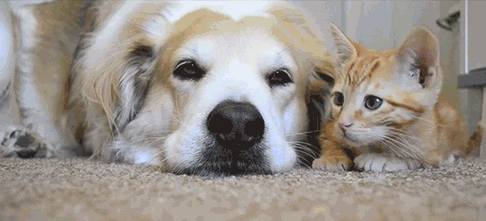

```{r setup, include=FALSE}
knitr::opts_chunk$set(echo = TRUE)
library(tidyverse)
library(keras)
```

# Overview

Deep neural networks using convulotional layers are currently (2018) the best immage classification algorithms out there... Let's build one to see what its all about.  

How about identifying cats and dogs?  



_This post follows through the example in the book “Deep learning with R” by Francios Chollet with J. J. Alaire._  

## Download data

The data can be downloaded from https://www.kaggle.com/c/dogs-vs-cats/data after logging in and accepting the rules.

Now we create a small subset to train on:  

From the kaggle dataset we get a train and test folder with a range of images of all shapes and sizes. To construct our set I will pull some immages from the train folder  

```{r, eval=FALSE}
original_dataset_dir <- "static/data/all/train/"
base_dir <- "static/data/selected_small_sample"
dir.create(base_dir)
train_dir <- file.path(base_dir, "train")
dir.create(train_dir)
validation_dir <- file.path(base_dir, "validation")
dir.create(validation_dir)
test_dir <- file.path(base_dir, "test")
dir.create(test_dir)
train_cats_dir <- file.path(train_dir, "cats")
dir.create(train_cats_dir)
train_dogs_dir <- file.path(train_dir, "dogs")
dir.create(train_dogs_dir)
validation_cats_dir <- file.path(validation_dir, "cats")
dir.create(validation_cats_dir)
validation_dogs_dir <- file.path(validation_dir, "dogs")
dir.create(validation_dogs_dir)
test_cats_dir <- file.path(test_dir, "cats")
dir.create(test_cats_dir)
test_dogs_dir <- file.path(test_dir, "dogs")
dir.create(test_dogs_dir)
fnames <- paste0("cat.", 1:1000, ".jpg")
file.copy(file.path(original_dataset_dir, fnames),
          file.path(train_cats_dir))
fnames <- paste0("cat.", 1001:1500, ".jpg")
file.copy(file.path(original_dataset_dir, fnames),
          file.path(validation_cats_dir))
fnames <- paste0("cat.", 1501:2000, ".jpg")
file.copy(file.path(original_dataset_dir, fnames),
          file.path(test_cats_dir))
fnames <- paste0("dog.", 1:1000, ".jpg")
file.copy(file.path(original_dataset_dir, fnames),
          file.path(train_dogs_dir))
fnames <- paste0("dog.", 1001:1500, ".jpg")
file.copy(file.path(original_dataset_dir, fnames),
          file.path(validation_dogs_dir))
fnames <- paste0("dog.", 1501:2000, ".jpg")
file.copy(file.path(original_dataset_dir, fnames),
          file.path(test_dogs_dir))
```

Count prepared files:  

```{r, eval=FALSE}
cat("total training cat images:", length(list.files(train_cats_dir)), "\n")

cat("total training dog images:", length(list.files(train_dogs_dir)), "\n")

cat("total validation cat images:",
length(list.files(validation_cats_dir)), "\n")

cat("total validation dog images:",
length(list.files(validation_dogs_dir)), "\n")

cat("total test cat images:", length(list.files(test_cats_dir)), "\n")

cat("total test dog images:", length(list.files(test_dogs_dir)), "\n")
```

`total training cat images: 1000 `  
`total training dog images: 1000 `  
`total validation cat images: 500`  
`total validation dog images: 500 `  
`total test cat images: 500`  
`total test dog images: 500`  

Everthing looks good!

## Build network

We first try building a network using conv_layers that take window samples size 3x3. Each of these layers try to identify local features in the data that are predictive. This is quite different from the fully connected networks that try to learn global rules that are predictive:  

```{r}
model <- keras_model_sequential() %>%
  layer_conv_2d(filters = 32, kernel_size = c(3, 3), activation = "relu",
                input_shape = c(150, 150, 3)) %>%
  layer_max_pooling_2d(pool_size = c(2, 2)) %>%
  layer_conv_2d(filters = 64, kernel_size = c(3, 3), activation = "relu") %>%
 layer_max_pooling_2d(pool_size = c(2, 2)) %>%
  layer_conv_2d(filters = 128, kernel_size = c(3, 3), activation = "relu") %>%
  layer_max_pooling_2d(pool_size = c(2, 2)) %>%
  layer_conv_2d(filters = 128, kernel_size = c(3, 3), activation = "relu") %>%
  layer_max_pooling_2d(pool_size = c(2, 2)) %>%
  layer_flatten() %>%
  layer_dense(units = 512, activation = "relu") %>%
  layer_dense(units = 1, activation = "sigmoid")

summary(model)

```

The max pooling layers here basically take the maximum output from smaller 2x2 windows. This teaches the network to compine local features and also reduces the exploding number of parameters in the model.  

And compile the network:  

```{r, eval=FALSE}
model %>% compile(
  loss = "binary_crossentropy",
  optimizer = optimizer_rmsprop(lr = 1e-4),
  metrics = c("acc")
)
```

## Data preprocessing

Keras has awesome built in functions to import and process image data. We call these functions generators. A generator will "flow" through all the images in a folder and produce batches on which the network can train.

Here we define a image data generator and then use it to flow all the images from the directories we created into a batches to train on:  

```{r, eval=FALSE}
train_datagen <- image_data_generator(rescale = 1/255)
validation_datagen <- image_data_generator(rescale = 1/255)

train_generator <- flow_images_from_directory(
  train_dir,
  train_datagen,
  target_size = c(150, 150),
  batch_size = 20,
  class_mode = "binary"
)

validation_generator <- flow_images_from_directory(
  validation_dir,
  validation_datagen,
  target_size = c(150, 150),
  batch_size = 20,
  class_mode = "binary"
)
```

We can use generator_next to see what data will flow into the network on each iteration.  

```{r, eval=FALSE}
batch <- generator_next(train_generator)
str(batch)
```

Having the generator produce batches endlessly means we need to define how many batches make up an epoch:  
Notice that instead of using the fit() function we use the fit_generator function.  

```{r,eval=FALSE}
history <- model %>% fit_generator(
  train_generator,
  steps_per_epoch = 100,
  epochs = 30,
  validation_data = validation_generator,
  validation_steps = 50
)

history %>% plot()

ggsave("Pictures/model_1_train.jpeg")
model %>% save_model_hdf5("static/models/cats_and_dogs_small_1.h5")
```


Using our conv_net we get pretty good out of box accuracy on the data...  

We see however that the small sample size of our data does not generalize quite well enough to classify all our validation data. We will need to address this overfitting.  

## Image data augmentation

### How it works

Even though conv_nets can learn local features from images and find these anywhere in an image it may still miss strange, unseen versions of these configurations.  

When we have smaller sample sizes of images to train on the model may overfit or fail to generalize. To help the model generalize better to the out of sample test set we can apply some transformations to the data so that the model can learn new representations of images:  

```{r}
datagen <- image_data_generator(
  rescale = 1/255,
  rotation_range = 40,
  width_shift_range = 0.2,
  height_shift_range = 0.2,
  shear_range = 0.2,
  zoom_range = 0.2,
  horizontal_flip = TRUE,
  fill_mode = "nearest"
)
```

**Remember we only want to alter training images! NOT validation images!**  

Let's view the transformation by supplying it one of the cat images in our training set:  

```{r,eval=FALSE}
fnames <- list.files(train_cats_dir, full.names = TRUE)
img_path <- "static/data/selected_small_sample/train/cats/cat.762.jpg"

img <- image_load(img_path, target_size = c(150, 150))
img_array <- image_to_array(img)
img_array <- array_reshape(img_array, c(1, 150, 150, 3)) # 1 sample, 150 by 150 pixels with 3 channels for RGB

test_case_generator <- flow_images_from_data(
  img_array,
  generator = train_datagen,
  batch_size = 1
)

  test_case <- generator_next(test_case_generator)
  plot(as.raster(test_case[1,,,]))
```


By using this image we can produce more transformed images for the model to learn from:  

```{r, eval=FALSE}
augmentation_generator <- flow_images_from_data(
  img_array,
  generator = datagen,
  batch_size = 1
)

op <- par(mfrow = c(2, 2), pty = "s", mar = c(1, 0, 1, 0))
for (i in 1:4) {
  batch <- generator_next(augmentation_generator)
  plot(as.raster(batch[1,,,]))
}
par(op)

```


Now the model not only benefits from identifying local features anywhere in the image, but also has learned how they can occur from different angles or points of view.  

### Create new network

Now that we are augmenting images we can also add some dropout to the network to help with the overfitting:  

```{r}
model <- keras_model_sequential() %>%
  layer_conv_2d(filters = 32, kernel_size = c(3, 3), activation = "relu",
                input_shape = c(150, 150, 3)) %>%
  layer_max_pooling_2d(pool_size = c(2, 2)) %>%
  layer_conv_2d(filters = 64, kernel_size = c(3, 3), activation = "relu") %>%
  layer_max_pooling_2d(pool_size = c(2, 2)) %>%
  layer_conv_2d(filters = 128, kernel_size = c(3, 3), activation = "relu") %>%
  layer_max_pooling_2d(pool_size = c(2, 2)) %>%
  layer_conv_2d(filters = 128, kernel_size = c(3, 3), activation = "relu") %>%
  layer_max_pooling_2d(pool_size = c(2, 2)) %>%
  layer_flatten() %>%
  layer_dropout(rate = 0.5) %>%
  layer_dense(units = 512, activation = "relu") %>%
  layer_dense(units = 1, activation = "sigmoid")
model %>% compile(
  loss = "binary_crossentropy",
  optimizer = optimizer_rmsprop(lr = 1e-4),
  metrics = c("acc")
)

model %>% summary
```

The dropout is one way of regularizing the network so it doesn't overfit the trainig data too easily.  

### Train new network with augmentation generators

Here are the final generators for the network:  

```{r, eval=FALSE}
datagen <- image_data_generator(
  rescale = 1/255,
  rotation_range = 40,
  width_shift_range = 0.2,
  height_shift_range = 0.2,
  shear_range = 0.2,
  zoom_range = 0.2,
  horizontal_flip = TRUE
)
test_datagen <- image_data_generator(rescale = 1/255)
train_generator <- flow_images_from_directory(
  train_dir,
  datagen,
  target_size = c(150, 150),
  batch_size = 32,
  class_mode = "binary"
)
validation_generator <- flow_images_from_directory(
  validation_dir,
  test_datagen,
  target_size = c(150, 150),
  batch_size = 32,
  class_mode = "binary"
)
```

Let's see how well the new deep learning model learns:  

_Careful; even on my GTX1070 this took over 15 min_

```{r, eval=FALSE}
history <- model %>% fit_generator(
  train_generator,
  steps_per_epoch = 100,
  epochs = 100,
  validation_data = validation_generator,
  validation_steps = 50
)

history %>% plot()

ggsave("Pictures/model_2_augmented_train.jpeg")
model %>% save_model_hdf5("static/models/cats_and_dogs_small_2.h5")
```


This is quite a substantial improvement! But can we do better than just rotating and zooming some images?  

## Further optimization

A simple way to improve this model is to leverage transfer learning.  

By tapping into already trained networks we can use their weights and layers as a good starting point for our network.  

### Transfer learning - VGG16

There are 2 ways to use transfer learning in our models:  
1) Feature extraction  
2) Fine-tuning  

Feature extraction is executed by extracting the convolution layers of the pre-trained network. Using this network we can predict the feature maps produced by the pre-trained model. With this output we can then create the classifier network to predict the outcome classes. This way we only back propogate through the classifier network.  

Fine tuning is a lot more expensive in comparison... Using this conv_net base and stacking a new dense layer for your classifier you can back propogate your data through the entire network to teach the model how to update all the layer weights that learn from the features extracted by the pre-trained convolutional network base layers.  

```{r, eval=FALSE}
conv_base <- application_vgg16(
 weights = "imagenet",
  include_top = FALSE,
  input_shape = c(150, 150, 3)
)

conv_base
```

This base has about 15 million parameters. It would be quite expensive to update the entire network using our data...  

#### Fine tuning model - vgg16 frozen

```{r, eval=FALSE}
model <- keras_model_sequential() %>%
  conv_base %>%
	layer_flatten() %>%
  layer_dense(units = 256, activation = "relu") %>%
  layer_dense(units = 1, activation = "sigmoid")

model
```

Now we are on 17 million params...  Don't try this on a CPU (omegaLUL?)  

Before we start our training we need to freeze the weights in the base layers. If we did not do this the new random weights of the top layers would destroy important weights in the base:  

```{r, eval=FALSE}

cat("This is the number of trainable weights before freezing",
      "the conv base:", length(model$trainable_weights), "\n")

freeze_weights(conv_base)

cat("This is the number of trainable weights after freezing",
      "the conv base:", length(model$trainable_weights), "\n")

```

Define our generators

```{r, eval=FALSE}
train_datagen = image_data_generator(
  rescale = 1/255,
  rotation_range = 40,
  width_shift_range = 0.2,
  height_shift_range = 0.2,
  shear_range = 0.2,
  zoom_range = 0.2,
  horizontal_flip = TRUE,
  fill_mode = "nearest"
)
test_datagen <- image_data_generator(rescale = 1/255)
train_generator <- flow_images_from_directory(
  train_dir,
  train_datagen,
  target_size = c(150, 150),
  batch_size = 20,
  class_mode = "binary"
)
validation_generator <- flow_images_from_directory(
  validation_dir,
  test_datagen,
  target_size = c(150, 150),
  batch_size = 20,
  class_mode = "binary"
)

```

Train the model

_Dont't do this without a GPU! This took about 15 min on a GTX1070_  

```{r, eval=FALSE}

model %>% compile(
  loss = "binary_crossentropy",
  optimizer = optimizer_rmsprop(lr = 2e-5),
  metrics = c("accuracy")
)

history <- model %>% fit_generator(
  train_generator,
  steps_per_epoch = 100,
  epochs = 30,
  validation_data = validation_generator,
  validation_steps = 50
)

history %>% plot()

ggsave("Pictures/model_3_vgg16_frozen.jpeg")
model %>% save_model_hdf5("static/models/cats_and_dogs_small_3_vgg16_frozen.h5")
```


#### Fine tuning model - unfreeze some conv_layers

We can use the `unfreeze_weights` function to unfreeze weights. In this case we don't want to unfreeze all the weights since we believe the first layers are summarizing very general features. Instead we want to update the later convolutional layers that are interpreting base feature maps.  

```{r, eval=FALSE}
conv_base
```

So if we unfreeze from `block3_conv1` we will still have the first 2 segments of conv_layers and max pooling frozen:  

```{r, eval=FALSE}
unfreeze_weights(conv_base, from = "block3_conv1")
```

**Remember to recompile the model after unfreezing weights!**  

```{r, eval=FALSE}
model %>% compile(
  loss = "binary_crossentropy",
  optimizer = optimizer_rmsprop(lr = 1e-5),
  metrics = c("accuracy")
)

```

And we train again:  

```{r, eval=FALSE}
history <- model %>% fit_generator(
  train_generator,
  steps_per_epoch = 100,
  epochs = 100,
  validation_data = validation_generator,
  validation_steps = 50
)


history %>% plot()

ggsave("Pictures/model_4_vgg16__half_frozen.jpeg")
model %>% save_model_hdf5("static/models/cats_and_dogs_small_4_vgg16_half_frozen.h5")
```


Our final tuned and optimized network performs like this:  

```{r, eval=FALSE}
model %>% evaluate_generator(validation_generator, steps = 50)
```

`$loss`  
`[1] 0.2387689`  
`$acc`  
`[1] 0.979`  


98% accuracy? Not bad!  

